# Kubernetes Starter Guide

## Introduction

Kubernetes AKA k8s is a container orchestrator, maybe the most popular these days, what does that mean?. Basically that given a set of containers (docker ones) you can create and operate them as a cluster of nodes, have its own networking layer and more. K8s was created by google and now is an open source product owned by CNCF (cloud native computing foundation).

This is k8s in a nutshell:
<p align="center">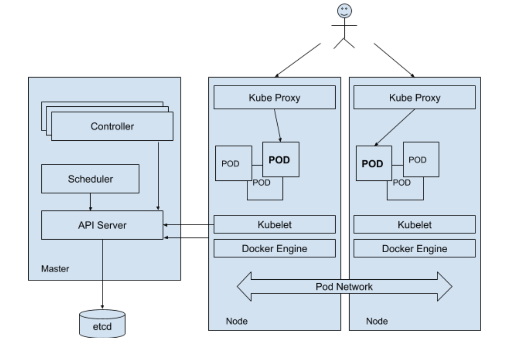</p>

As you can see there is a master node and of course is the most important node. The master node in production is not a single node. As you may notice, the master node has a etcd store, this is where the node saves the cluster state. It has an API Server too, it is essentially a rest api that you can consume as well as internally k8s’s components. The scheduler is just another scheduler, like the ones in the kernel of any OS but k8s scheduler monitors the node’s resources like memory, cpu, etc in order to schedule a node creation, etc. Controllers are components that manage high level concepts like replication, autoscaling groups, etc.

The nodes are the actual place where the application runs. Each one has a docker engine and a kubelet. The kubelet is connected to the controllers and it is responsible for containers creation, and managing.

In k8s the containers are organized into a thing called POD. A pod is a set of 1 or more containers that runs like an atomic unit, it runs like in the same host. So a pod is an atomic structure of containers that has its own IP in the cluster, and can communicate with other cluster’s pod. The kube proxy is actually that, a proxy that is in front of pods and assigns a single ip to them. In kubernetes you can create services, which is a set of pods that provide that, as service. In this context, the proxy will assign a single ip to the services in order you can reach them. Kube Proxy implements a very simple load balancing when there are multiple instances running in multiple pods.

## Get your hands dirty.. Setting up minikube
Minikube is the option to run k8s in the local environment. In order to run minikube you will need:

* VirtualBox: installation instructions [here](https://www.virtualbox.org/wiki/Downloads)
* kubectl (cli tool): installation instructions [here](https://kubernetes.io/docs/tasks/kubectl/install)
* minikube itself: installation instructions [here](https://github.com/kubernetes/minikube/releases)

After the installation of the three tools you can execute the `minikube start` command to start your k8s environment. Grab a coffee.

<p align="center">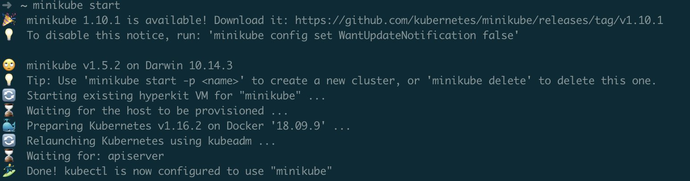</p>

Notice this screenshot is not of the very first time I ran the installation, in your case minikube command will download an ISO image, create a VM, configure the system and run everything, could take some time.

When the installation finishes, you can run `kubectl get nodes` and you will see something similar to this:

<p align="center">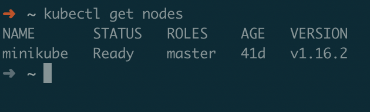</p>

## From the basis
We will start from scratch and to do that we won’t innovate, we just need to start an NGINX web server.

Kubernetes defines resources, pods, services, etc in a yaml file, then we will create a `nginx-pod.yaml` file and add the following content:

```yaml
apiVersion: v1
kind: Pod
metadata:
  name: nginx-test
spec:
  containers:
  - name: nginx
    image: nginx
    ports:
      - containerPort: 80
        name: http
        protocol: TCP
```

That’s it. As you can see there is some metadata like pod name, version number, etc but the real specification is the spec section. We will dig in later on each label but as you can see is pretty straightforward. Notice the spec section, you have a containers label and this is a list of images just in case you need more images to run. Having this file, you can run the command `kubectl apply -f` as follows:

<p align="center">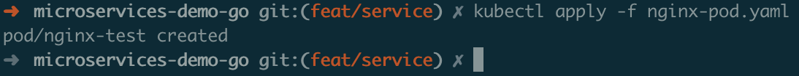</p>

Then we can see the pod status using `kubectl get pods` command:

<p align="center">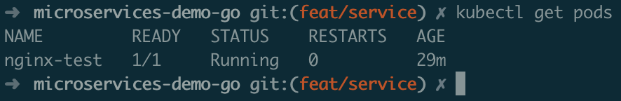</p>

We can tune this specs in order to use some resources limits like cpu and mem using something like:

```yaml	
  containers:
  - name: nginx
    image: nginx
    resources:
      limits:
        memory: 256Mi
        cpu: 0.5
    ports:
```

<p align="center">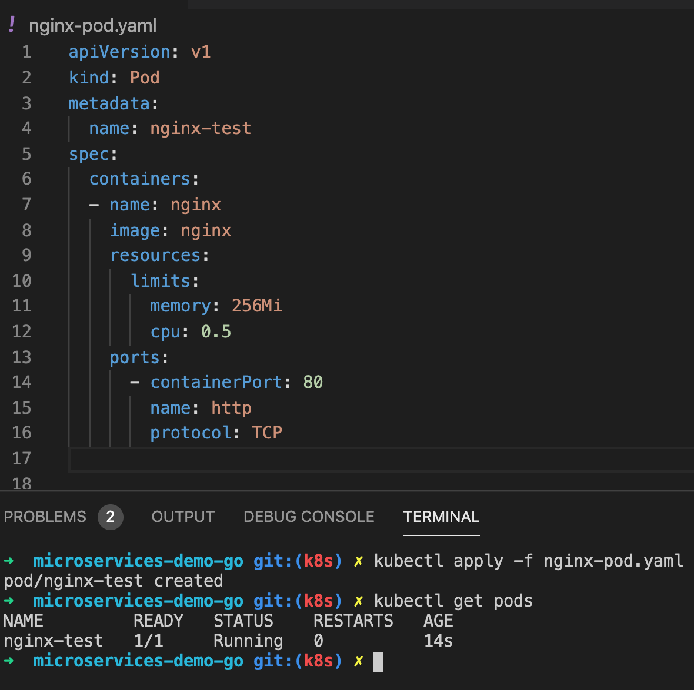</p>

In order to apply again the pod configuration you must delete the previously created pod using `kubectl delete pod nginx-test`
One important detail to note is that in Kubernetes the pods weren't thought to be persisted and if the node fails the pods will fail and not be recovered, so the Controllers appear in the scene. Controllers can deploy (called deployment controller) a pod for you and keep it working if it fails adding more instances if needed.

Let's remove the pod previously created using `kubectl delete pod nginx-test` command. Now create the following `nginx-deployment.yaml` file:

```yaml
apiVersion: apps/v1
kind: Deployment
metadata:
 name: nginx-deployment ## deployment controller name
spec:
 replicas: 2
 selector:
   matchLabels:
     app: nginx-app-template ## what we want to replicate
 template:
   metadata:
     labels:
       app: nginx-app-template ## the application name, usually nginx-app
   spec:
     containers:
     - name: nginx ## just a container name
       image: nginx ## this is the docker image
       ports:
       - containerPort: 80
         name: http
         protocol: TCP
``` 
See documentation [here](https://kubernetes.io/docs/concepts/workloads/controllers/deployment/#creating-a-deployment)

This configuration will create a deployment controller named nginx-deployment and takes care for you that two pods are always running using replicas label. The rest of the configuration is similar to the previous version, the spec using a list of images. We can run the `kubectl apply -f` as usual:

<p align="center">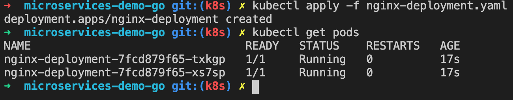</p>

Here we have the two pods running and in case some pod fails the controller will create another one. Let’s see it in action:

<p align="center">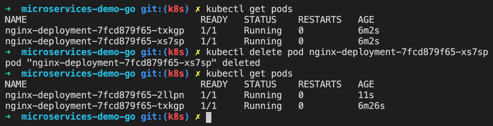</p>

Notice that we delete a pod called `nginx-deployment-7fcd879f65-xs7sp` and another appears automatically, this happens because we have two replicas and the `spec.selector.matchLabels.app` points to the `spec.template.metadata.labels.app`, so the `deployment-controller` will start a new nginx. One important thing here is that `spec.selector.matchLabels` uses a `key-value` to select the template to replicate, let’s say that in our case selects an `app=nginx-app-template` but obviously is flexible enough to use another key too.

Interesting, now we have a given amount of replicas up guaranteed but what about horizontal scaling?. So, in case you want more replicas you can add a spec.scale in the yaml file or you can add it using the `kubectl edit` command:
				
`kubectl edit deployment nginx-deployment`

When you execute that command you will see an editor to edit whatever you need, in my case I see this:

<p align="center">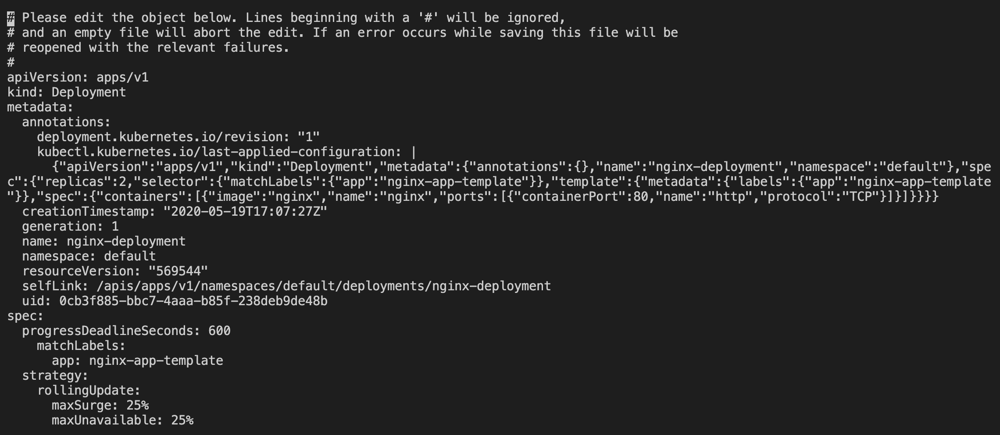</p>

I can move the cursor and modify things. In the special case of `spec.scale`, there is a kubectl option that helps us saving time:

`kubectl scale --replicas=4 deployment/nginx-deployment`

This command scales horizontally the amount of pods (replicas) from 2 to 4 and uses the `deployment/nginx-deployment` to do the scaling following the kind/name pattern. You will see something similar to this:

<p align="center">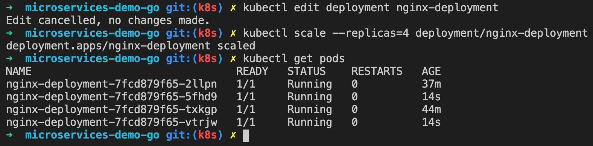</p>

Note that you modify the deployment controller configuration in Kubernetes and not your yaml file. Another very interesting thing is this:

`kubectl autoscale deployment.v1.apps/nginx-deployment --min=10 --max=15 --cpu-percent=80`

Now we say kubernetes autoscale automatically the deployment called `nginx-deployment` with a minimum of 10 and maximum of 15 and the scaling threshold is 80% of cpu uses. You can use the selector `deployment/nginx-deployment` like the previous command too. You should see something like this (you may wait some seconds):

<p align="center">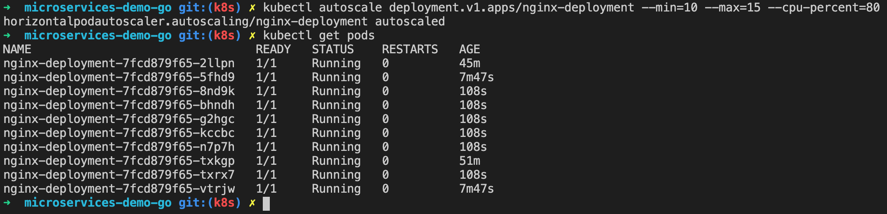</p>

To know about the horizontal scaling parameters you can run `kubectl get hpa` and you will see something like this:

<p align="center">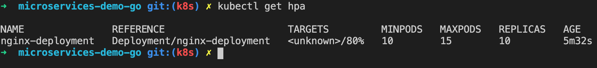</p>

`HPA` is another kind of controller that takes care of the scaling, so you can delete it as usual: `kubectl delete hpa/nginx-deployment`
If you modify the hpa controller configuration to, for example set the minimum = 2 and maximum = 5 the pods instances will decrease automatically, this is the scale down a quite bit forced, you can delete pods instead.

<p align="center">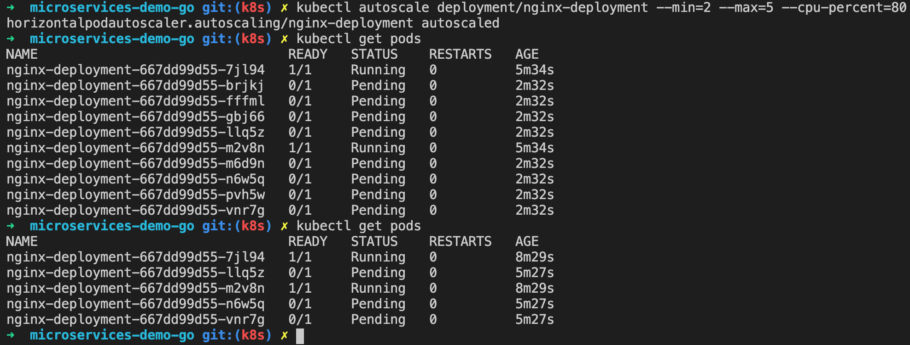</p>

An important option is the describe flag, you can use it to for example to know about a deployment like this:

<p align="center">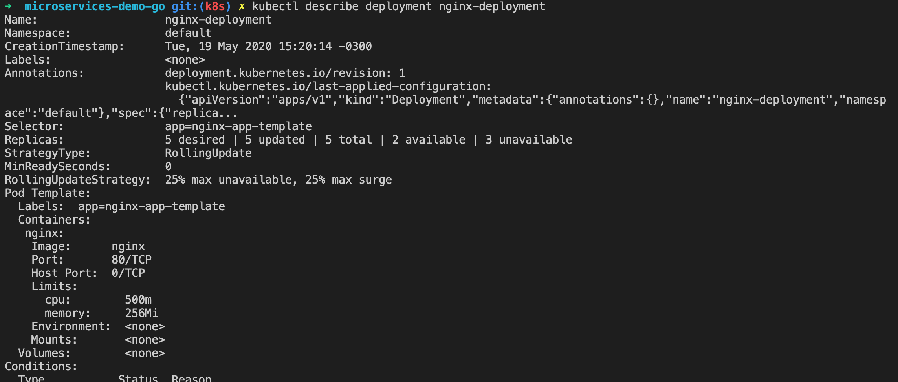</p>

It returns the computed configuration stored in the master node (etcd).

Ok, let's get things more interesting.. Services!

## Services

Currently we have some pods running (2 or 5) but we can not access them and for this reason we will play with services. Our current status:

<p align="center">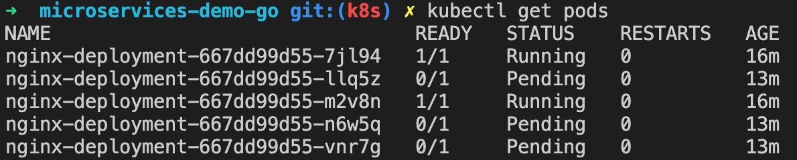</p>

Pay attention to the STATUS column, we have 2 running. Let’s create a `nginx-service.yaml` file with the following content:

```yaml
apiVersion: v1
kind: Service
metadata:
 name: nginx
spec:
 type: NodePort
 selector:
   app: nginx-app-template ## this is spec.template.metadata.labels.app value from nginx-deployment.yaml
 ports:
 - name: http
   port: 80
```

Here we have defined a service name nginx, and we point this service to the template defined in the `nginx-deployment.yaml`, more specifically `spec.template.metadata.labels.{key} = {value}`. An important detail here is the `spec.type: NodePort` property, this means that each Kube Proxy will open a TCP port within a random port number that you can use to connect to the nginx running in the pod from outside. All the traffic received in that random port will be forwarded to one of the pods matched by the selector specified, to the (in this example) port 80.

<p align="center">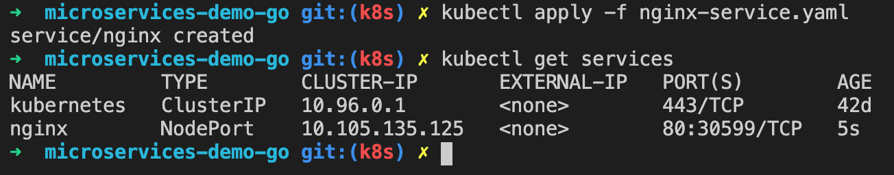</p>

Apply the configuration using our well known `kubectl apply -f` command. Now is time to fancy things.. Let’s execute this command: minikube service nginx. You will see something similar to this:

<p align="center">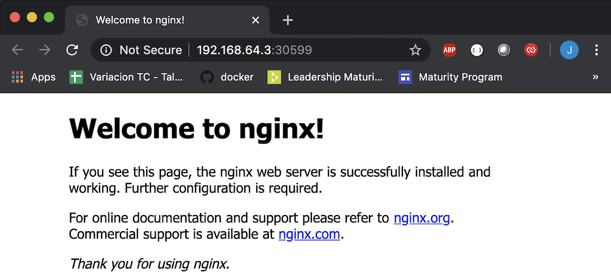</p>

This means that from `localhost` you access one of the pods running in the k8s, passing through the Proxy that selects one of the running pods (load balancing!). Sounds great ah?.

As you can see the IP for my nginx service is `192.668.64.3` and the port is `30599`. This ip:port is mapped (by the proxy) to one of the two pods running on port 80. Do you remember when I said that the pods can scale up and down automatically?. As I wrote before, the pod must be seen as a non permanent component and if you want to store something you must use Kubernetes Volumes instead of the local docker storage.

## Persistent Volumes

As we mentioned, it is not a good idea to store data in the docker filesystem so the Persistent Volumes appeared in Kubernetes. This is like a fancy abstraction of docker volumes. In order to create a persistent volume for our examples you can create a file called data-volume.yaml with the following content:

```yaml
apiVersion: v1
kind: PersistentVolume
metadata:
 name: task-pv-volume
 labels:
   type: local
spec:
 storageClassName: manual
 capacity:
   storage: 10Gi
 accessModes:
   - ReadWriteOnce
 hostPath:
   path: "/mnt/data"
```

Then apply it:

<p align="center">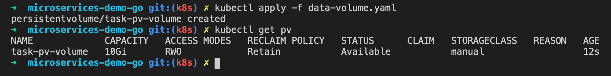</p>

As you can see I ran the, up to this point, well known `kubectl apply -f` and then I ran the `kubectl get pv` command to see if the volume exists or not. Let’s inspect the yaml file a bit, we define a name in the metadata section and in the specs we define the capacity, the access modes and the hostPath. Pay attention to this last one, hostPath is just for testing on the node that has the pods, suppose you have several nodes, no one will access this volume except the node that has the volume in it. To solve this problem we can use the `accessModes` property.

So.. Now we want to use the just created volume. Before we use it, we have to claim it and this is because Kubernetes decouples the volume creation from uses just because in most scenarios the one that uses the volume is not the same that creates it. In order to claim a volume we have to create a `volume-claim` file like `data-volume-claim.yaml` with the following content:

```yaml
apiVersion: v1
kind: PersistentVolumeClaim
metadata:
  name: task-pv-claim
spec:
  storageClassName: manual
  selector:
    matchLabels:
        type: local ## this points to the real volume.
  accessModes:
    - ReadWriteOnce
  resources:
    requests:
      storage: 3Gi
```

Then run `kubectl apply -f data-volume-claim.yaml` and the `kubectl get pvc` commands like this:

<p align="center">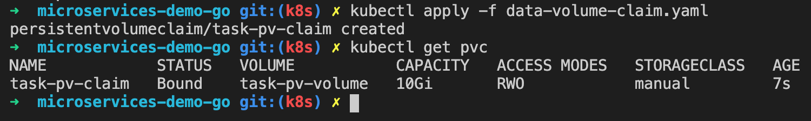</p>

At this point you have a persistent volume (pv) and a persistent volume claim (pvc) associated. To check this out you can run the `kubectl get pv` and see the claim and status column:

<p align="center">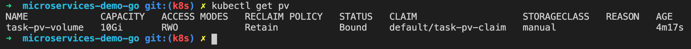</p>

In order to access to this volume from the pod we have to tell it how using it in the nginx-deployment.yaml config file:

```yaml
apiVersion: apps/v1
kind: Deployment
metadata:
 name: nginx-deployment ## deployment controller name
spec:
 replicas: 2
 selector:
   matchLabels:
     app: nginx-app-template ## what we want to replicate
 template:
   metadata:
     labels:
       app: nginx-app-template ## the application name, usually nginx-app
   spec:
     volumes:
       - name: data
         persistentVolumeClaim:
           claimName: task-pv-claim
     containers:
     - name: nginx ## just a container name
       image: nginx ## this is the docker image
       resources:
         limits:
           memory: 256Mi
           cpu: 0.5
       ports:
       - containerPort: 80
         name: http
         protocol: TCP
```

The `spec.template.spec.volumes` is a list of volumes. In this case we defined a volume named data and we tell k8s that the volume will be claimed using our previously created persistent volume claim. Note we modify the deployment config and not the very first `nginx-pod.yaml`, this is because the pods will be deployed by a deployment controller, then we have to define the pod there.

## Making available our docker images
In order to deploy an actual microservice just coded in our local environment we have to make sure that the kubernetes cluster has access to your images. Usually you may have your images in a docker registry for this but if you are using minikube you may want to use another, and simple, way:
				
`eval $(minikube docker-env)`

`docker image build -t myservices/myservice .`

The first command makes available the docker engine inside the vm that runs minikube, so you are not using your local docker engine anymore. The second command builds and registers a docker image.	What about if you are using a private docker hub?, you must use credentials. In order to use credentials privately you can use the following command:
				
`kubectl create secret docker-registry my-private-registry --docker-server https://index.docker.io/v1/ --docker-username <your-username> --docker-password <your-password> --docker-email <your-email>`

As you can see, the flag `--docker-server` defines the docker hub you want. The rest of the config flags are straight forward. Now you can use the `my-private-registry` secret just created like:

```yaml
apiVersion: v1
   kind: Pod
   metadata:		
    name: example-from-private-registry
   spec:	
    containers:
     - name: secret	
      image: quay.io/jpp-private-registry/secret-application:v1.2.3
     imagePullSecrets:
     - name: my-private-registry
```				

Using the `imagePullSecrets` attribute also works when you are creating Pods using a StatefulSet or a Deployment controller. 

## Ingress
Up to now we have a service that uses a random port each time we load it but what about if we want to use a given port like 80 or 443?. In order to interface with the kubernete node using a given port we must use ingress. Ingress is an addon that you have to install with the following command:

`minikube addons enable ingress`

Once the addon is installed you can apply the following configuration:

```yaml
apiVersion: extensions/v1beta1
kind: Ingress
metadata:
  name: nginx
spec:
  rules:
  - host: nginx.jpp.com
    http: 
      paths:
      - path: /
        backend:
          serviceName: nginx
          servicePort: 80
```

So, now we have to tell our operating system how to route the nginx.jpp.com because obviously is fake. First we have to know which IP minikube is using with the command `minikube ip`, then we can edit the hosts file on your system to add the route line like:

`192.168.64.3    nginx.jpp.com`

Now we can use `http://nginx.jpp.com` to access out nginx running in a pod into a node.

## Example summary
To simplify I created a no persistence volume deployment config, so we can run the following commands and see nginx working on our systems:

```bash
kubectl apply -f nginx-deployment-without-pv.yaml
kubectl apply -f nginx-service.yaml
kubectl apply -f nginx-ingress.yaml
```

And adding the ip on hosts mapped to `nginx.jpp.com` you can open the URL like this:

<p align="center">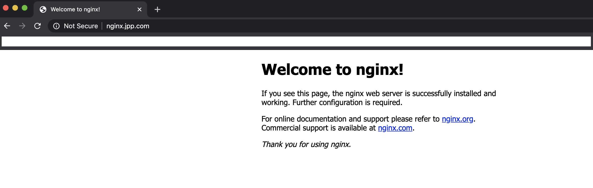</p>

### Bonus Track
You can access to a container using `kubectl get pods` to copy a pod name and then run the following command with the pod name:

`kubectl exec -it nginx-deployment-79fc57f8df-mh6qj -- /bin/bash`

## Conclusions
Now we can create a deployment defining replicas and using our custom docker image, we can scale up and down, we can add persistence using the persistence volumes and its claims, we can create a service and expose it on one given port.. smells like that is all we need to create a development environment. I hope this helps you in some way.


